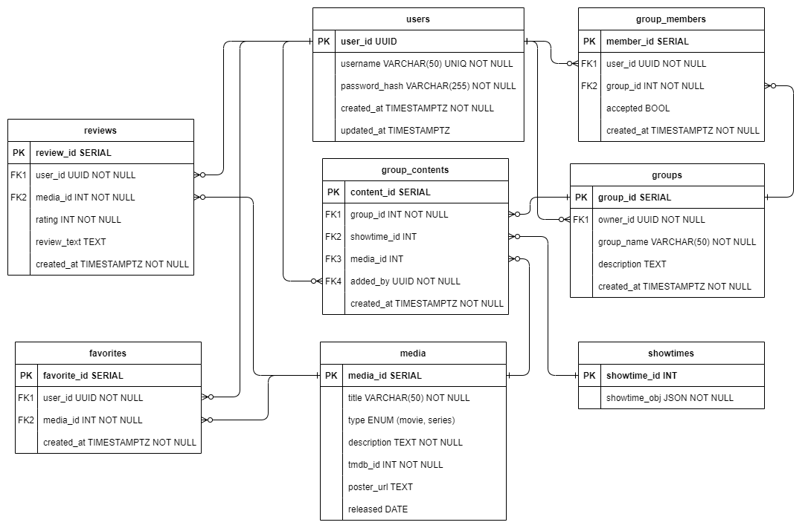
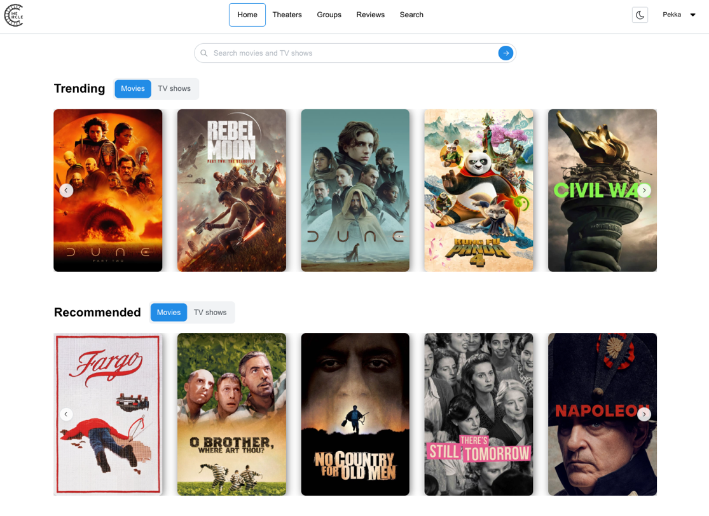
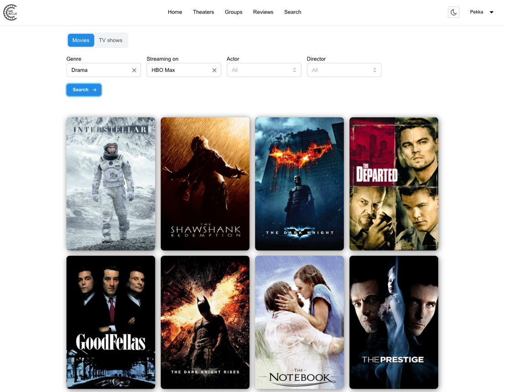

# Web-ohjelmoinnin sovellusprojekti
### 11.3. - 2.5.2024

Ensimmäinen fullstack projekti ja ensikosketus Reactiin. Projektikurssi kesti noin kahdeksan viikkoa, josta ensimmäiset kaksi viikkoa painottuivat opetukseen.
Suunnittelu- ja toteutusvaiheet kestivät yhteensä noin viisi viikkoa. Aikaa oli siis todella rajallisesti mutta pääsimme tavoitteisiin ja saimme täytettyä kaikki kurssin vaatimukset.

Sovellusta voi käydä kokeilemassa osoitteessa:
https://thecinecircle.onrender.com/

Alla kurssin aikana laadittu esittelyteksti.

# CineCircle

## Tekijät

- Aki Pyykkönen
- Elias Kämäräinen
- Juhani Mänty
- Miku Ohukainen

## Projektin esittely

CineCircle on Oulun ammattikorkeakoulun toisen vuoden tietotekniikan opiskelijoiden web-ohjelmoinnin sovellusprojekti. Projektissa toteutettiin elokuva-aiheinen sivusto, jonka käyttäjät voivat hakea elokuvateattereiden esitysaikoja sekä elokuvia ja sarjoja eri suodattimilla. Lisäksi käyttäjät voivat mm. kirjoittaa arvosteluja, lisätä suosikkeja, luoda ryhmiä, jakaa elokuvia ja sarjoja sekä lisätä sisältöä ryhmäsivulle.

Kurssivaatimuksina projektille oli luoda selaimessa toimiva monipuolinen web-sivusto, joka hyödyntää kahta olemassa olevaa rajapintaa: Finnkinon tarjoamia esitysaikoja sekä TMDB:n (The Movie Database) laajaa tietokantaa. Lisäksi projektissa tuli toteuttaa käyttäjänhallinnan yksikkötestaukset sekä käyttää projektin hallintaan yhtä kurssilla esitellyistä agile-menetelmistä (Scrum, Kanban).

## Vastuualueet

Projektin aikana jokainen ryhmän jäsen osallistui tietokannan, palvelimen ja käyttöliittymän suunnitteluun ja toteutukseen. Karkea vastuualuejako kuvattu taulukossa 1.

<table>
  <tr>
    <th></th>
    <th><b>Miku</b></th>
    <th><b>Elias</b></th>
    <th><b>Aki</b></th>
    <th><b>Juhani</b></th>
  </tr>
  <tr>
    <td><b>Suunnittelu ja dokumentaatio</b></td>
    <td>Tietokanta, ER-kaavio</td>
    <td>Projektin alustus</td>
    <td>UI-suunnitelma</td>
    <td>API-dokumentaatio</td>
  </tr>
  <tr>
    <td><b>Backend</b></td>
    <td>TMDB REST API</td>
    <td>Käyttäjänhallinta ja sen yksikkötestaus, tietokantamigraatiot, näytösaikojen lisäys</td>
    <td>Ryhmien hallinta, median jako ryhmiin, suosikkilistan jako</td>
    <td>Käyttäjän poisto, näytösaikojen jako</td>
  </tr>
  <tr>
    <td><b>Frontend</b></td>
    <td>Trendaavat elokuvat ja sarjat, suositukset, suodatettu haku, media- ja näyttelijäsivut</td>
    <td>Käyttäjän autentikointi, näytösaikojen selaus, arvostelujen lisäys ja selaus, sivun julkaisu, responsiivisuus ja teema</td>
    <td>Ryhmien hallinta, median jako ryhmiin, suosikkilistan jako</td>
    <td>Käyttäjän poisto, profiilisivu, näytösaikojen jako</td>
  </tr>
</table>

_TAULUKKO 1_. Vastuualuejako

## Arkkitehtuuri

Sovellus koostui kolmesta pääosasta: tietokannasta, sovelluslogiikasta ja käyttöliittymästä. Alla on tarkemmin kuvattu osien teknologiat ja niiden toiminta.

### Tietokanta

Tietokantana käytössä oli avoimen lähdekoodin relaatiotietokantajärjestelmä PostgreSQL. PostgreSQL valittiin käytettävyyden ja laajan dokumentaation vuoksi. Sovellus hyödynsi node-postgres ja db-migrate kirjastoja tietokannan kanssa kommunikointiin ja tietokantamigraatioiden hallintaan.

### Sovelluslogiikka

Sovelluslogiikka, eli backend, koostuu Express.js:llä toteutetusta REST APIsta. Se kommunikoi TMDB:n rajapinnan kanssa välittäen käyttöliittymän HTTP-pyyntöjä TMDB:lle. Käyttäjän autentikointi toteutettiin bcryptjs-kirjastolla ja auktorisoinnissa hyödynnettiin jsonwebtoken-kirjastoa. Chai ja Mocha kirjastoilla testattiin käyttäjän rekisteröinti, kirjautuminen ja poisto.

### Web-sovellus

Web-sovellus kehitettiin käyttäen Viteä rakennustyökaluna, mikä mahdollisti modernin kehitysympäristön ja nopean kehityksen mm. "hot reload"-ominaisuuden avulla. Sovellus hyödynsi Mantine-kirjaston komponentteja ja tyylittelyssä käytettiin CSS-moduuleja. Sovellus jaettiin komponentteihin ja sivuihin, jotta samoja komponentteja voitiin käyttää useilla sivuilla. Sivut reititettiin React Router -kirjastolla. Sovellus kommunikoi sekä oman että Finnkinon rajapinnan kanssa Finnkinon teknisten rajoitusten vuoksi.

## Tietokantarakenne

Tavoitteena oli luoda mahdollisimman yksinkertainen ja rakenteeltaan selkeä tietokanta, joka mahdollistaa työohjeeseen pohjautuvan tietosisältömallin mukaisen datan tallentamisen ja käsittelyn.

Tietokanta koostuu kahdeksasta taulusta, jotka voidaan jakaa seuraaviin osa-alueisiin: käyttäjäkohtainen data, ryhmäkohtainen data ja mediasisältö. Taulujen välisillä relaatioyhteyksillä mahdollistettiin kattavien SQL-kyselyjen tekeminen sekä tietosisällön hajautus useampaan tauluun. Tietokannan rakenne esitetty kuvassa 1.

_KUVA 1_. Tietokannan ER-kaavio

## Käyttöliittymä

Sovelluksen käyttöliittymä on suunniteltu selkeäksi ja responsiiviseksi, jotta se toimisi saumattomasti eri laitteilla. Elokuvat ja sarjat esitetään sivustolla kuvien avulla, mikä tekee sivustosta visuaalisesti miellyttävän ja helposti lähestyttävän.

Navigointi sovelluksessa on tehty helpoksi yläpalkin päävalikon avulla. Valikosta käyttäjä pääsee vaivattomasti esimerkiksi elokuvien hakuun, teatteriaikojen etsimiseen ja ryhmien selaamiseen. Päävalikosta käyttäjä voi myös valita, käytetäänkö sivustolla tummaa vai vaaleaa värimaailmaa.

Etusivulla (kuva 2) esitetään ajankohtainen näkymä, joka nostaa esiin suosittuja elokuvia ja sarjoja. Lisäksi etusivu tarjoaa kirjautuneelle käyttäjälle räätälöityjä suosituksia perustuen hänen suosikkilistaansa. Elokuvakohtaisella sivulla käyttäjä voi syventyä tarkempiin tietoihin elokuvasta. Sivulta löytyy myös mahdollisuus lisätä elokuva omiin suosikkeihin sekä ryhmiin, joissa käyttäjä on jäsenenä. Ryhmäkohtaisella sivulla esitetään ryhmän kuvaus, ryhmään lisätty media, näytösajat sekä ryhmän jäsenet. Profiilisivulla käyttäjä näkee koosteen kaikista hänen ryhmistään sekä suosikeistaan.

_KUVA 2_. Kirjautuneen käyttäjän etusivun näkymä

Sovelluksen hakusivu (kuva 3) tarjoaa monipuoliset työkalut elokuvien ja sarjojen etsimiseen. Käyttäjä voi hyödyntää useita eri hakukriteerejä, kuten genreä, näyttelijöitä, ohjaajia tai suoratoistopalvelua, jossa elokuva tai sarja on saatavilla. Hakutulokset esitetään selkeässä listanäkymässä, josta käyttäjä voi nopeasti selata tuloksia ja löytää etsimänsä.

_KUVA 3_. Hakusivu

## Lisenssi

Projekti on lisensoitu MIT-lisenssillä. Lisätietoja projektin [LICENSE](LICENSE) -tiedostosta.
